# QuemFaz

Sistema web de gestão de tarefas domésticas para famílias, desenvolvido para a disciplina de Infraestrutura e Serviços em Nuvem.

## Sobre o projeto

Dividir tarefas de casa costuma gerar atrito: alguém acha que faz mais que os outros, tarefas ficam esquecidas, e cobrar vira trabalho em si. O QuemFaz tira essa decisão do campo da opinião: qualquer membro cadastra uma tarefa com pontuação, idade mínima e horário-limite. Os membros elegíveis podem escolher livremente; se ninguém escolher a tempo, o sistema sorteia automaticamente entre quem pode fazê-la.

Pra evitar fraude, a conclusão de uma tarefa só é validada com a aprovação de outro membro (nunca de quem executou) — só então os pontos entram no placar da família.

Tecnicamente, é uma aplicação web na AWS com arquitetura de microsserviços orientada a eventos: login via Google (Cognito), regras de negócio em Lambda, dados no DynamoDB, notificações por email via SES e sorteio automático agendado pelo EventBridge Scheduler. Infraestrutura como código (IaC) e deploy automatizado via CI/CD.

## Documentação

- [Requisitos funcionais e não funcionais](docs/requisitos.md)
- [Regras de negócio](docs/regras-de-negocio.md)
- Casos de uso:
  - [UC01 · Autenticar-se](docs/casos-de-uso/caso-de-uso-1.md)
  - [UC02 · Criar núcleo familiar](docs/casos-de-uso/caso-de-uso-2.md)
  - [UC03 · Vincular membro ao núcleo](docs/casos-de-uso/caso-de-uso-3.md)
  - [UC04 · Cadastrar tarefa](docs/casos-de-uso/caso-de-uso-4.md)
  - [UC05 · Escolher tarefa](docs/casos-de-uso/caso-de-uso-5.md)
  - [UC06 · Sortear tarefa automaticamente](docs/casos-de-uso/caso-de-uso-6.md)
  - [UC07 · Marcar tarefa como concluída](docs/casos-de-uso/caso-de-uso-7.md)
  - [UC08 · Aprovar ou rejeitar conclusão](docs/casos-de-uso/caso-de-uso-8.md)
  - [UC09 · Visualizar placar](docs/casos-de-uso/caso-de-uso-9.md)

## Diagramas de blocos

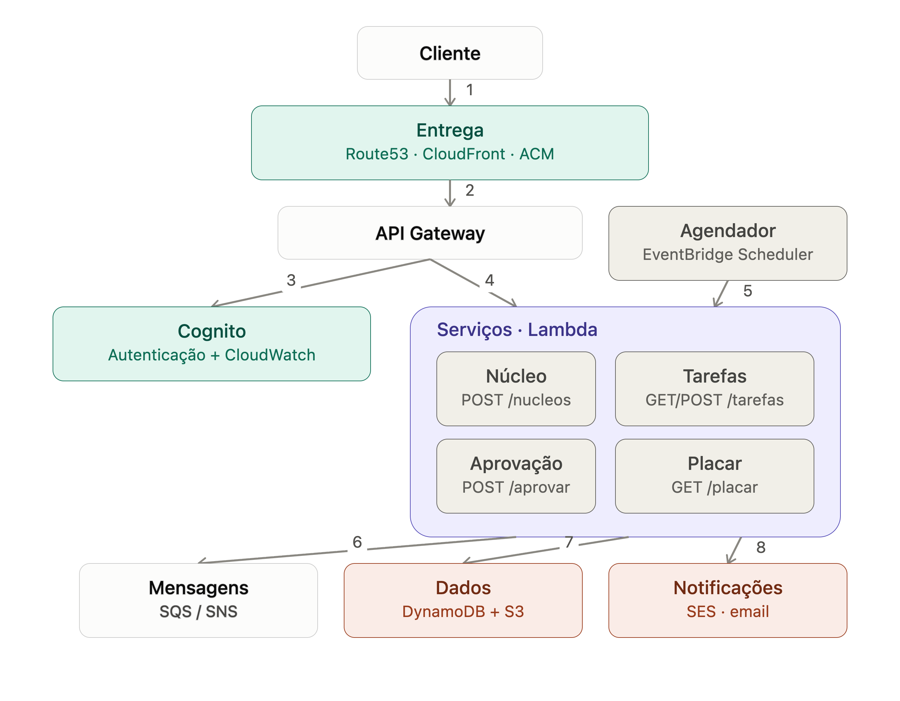

## Fluxogramas do Sistema

### Núcleo
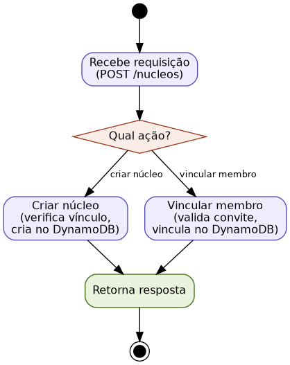

### Tarefas
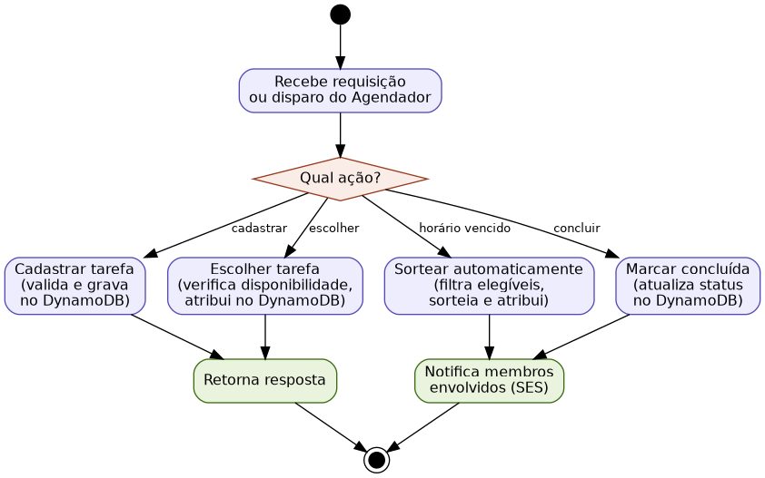

### Aprovação
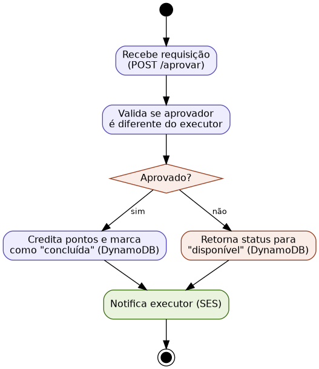

### Placar
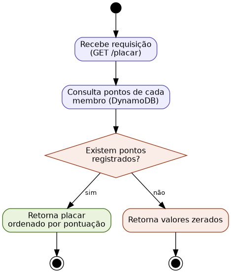

## Fluxogramas dos serviços AWS

### Entrega (Route53 + CloudFront + ACM)
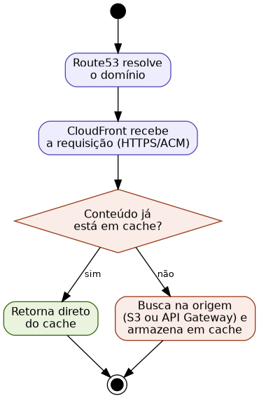

### API Gateway
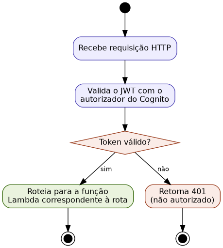

### Cognito
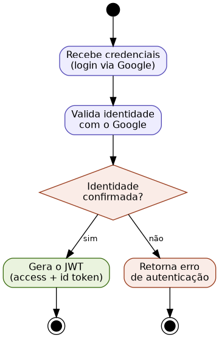

### Agendador (EventBridge Scheduler)
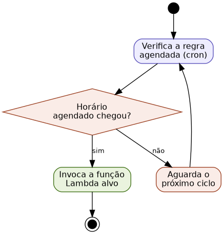

### Lambda
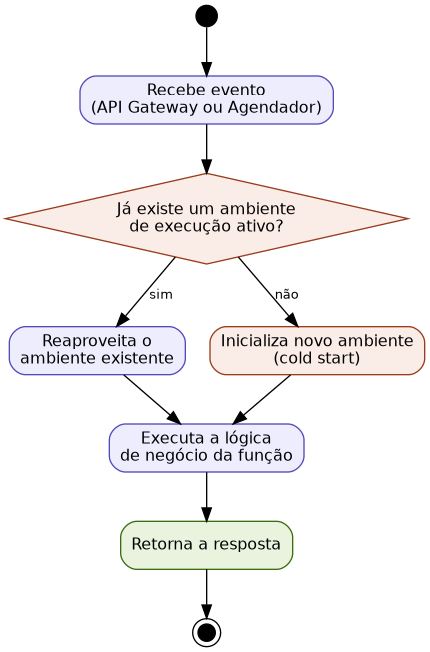

### Mensagens (SQS/SNS)
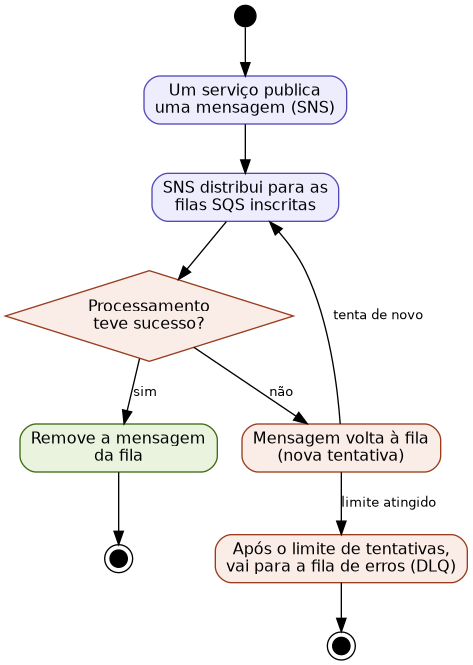

### Dynamo DB
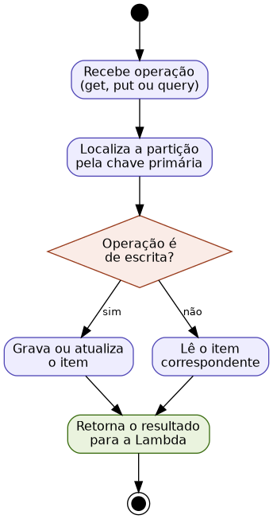

### Notificações (SES)
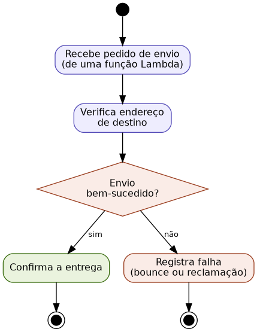

