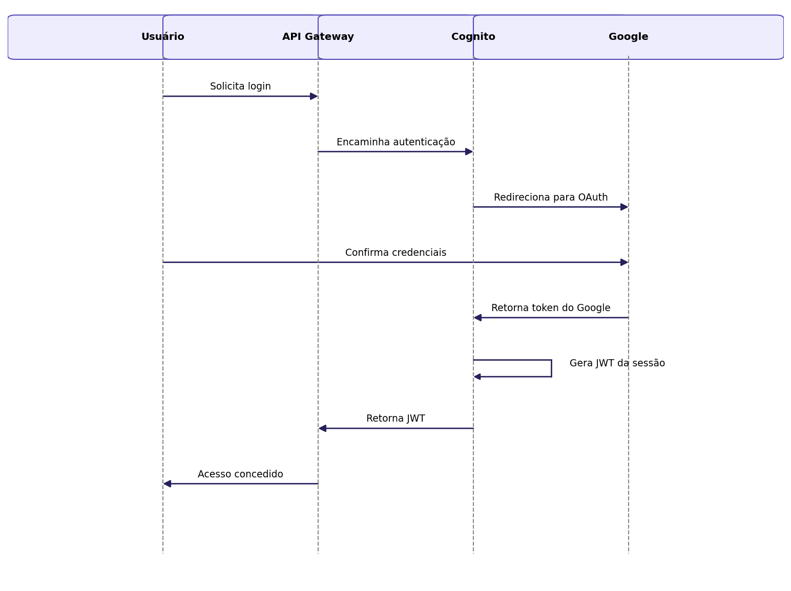

## Caso de Uso 01: Autenticar-se

**Ator principal/primário:** Membro da família

**Meta no contexto do projeto:** Permitir que o usuário acesse o sistema de forma segura utilizando sua conta Google.

### Pré-condições:

O usuário deve possuir uma conta Google válida.

### Fluxo principal / Cenários:

O usuário acessa a plataforma.

O usuário seleciona a opção "Entrar com Google".

O sistema redireciona o usuário para a autenticação OAuth do Google.

O usuário confirma suas credenciais junto ao Google.

O sistema valida o token retornado e cria ou recupera a sessão do usuário.

### Exceções e Fluxos alternativos:

**Fluxo alternativo 1 (Cancelamento):** Se o usuário cancelar a autenticação na tela do Google, o sistema retorna à tela de login sem criar sessão.

**Prioridade:** Alta

**Frequência de uso:** Alta

**Canal de interação com atores primário e secundários:** Interface Web.

