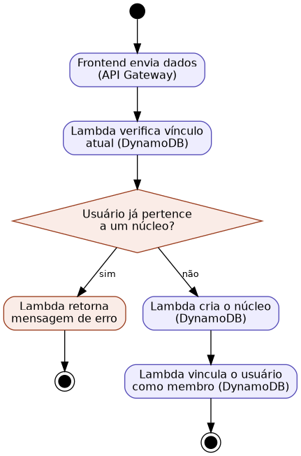

## Caso de Uso 02: Criar Núcleo Familiar

**Ator principal/primário:** Membro da família (Usuário Autenticado)

**Meta no contexto do projeto:** Permitir que um usuário autenticado crie um núcleo familiar para organizar e compartilhar tarefas domésticas com outros membros.

### Pré-condições:

O usuário deve estar autenticado no sistema.

O usuário não deve estar vinculado a nenhum núcleo familiar.

### Fluxo principal / Cenários:

O usuário seleciona a opção "Criar núcleo familiar".

O sistema exibe um formulário solicitando o nome do núcleo.

O usuário preenche o nome e confirma a criação.

O sistema cria o registro do núcleo familiar.

O sistema vincula o usuário como membro desse núcleo.

### Exceções e Fluxos alternativos:

**Exceção 1 (Já vinculado):** Se o usuário já pertencer a um núcleo familiar, o sistema exibirá uma mensagem informando que não é possível criar um novo núcleo e não prosseguirá com a criação.

**Prioridade:** Alta

**Frequência de uso:** Baixa

**Canal de interação com atores primário e secundários:** Interface Web.

