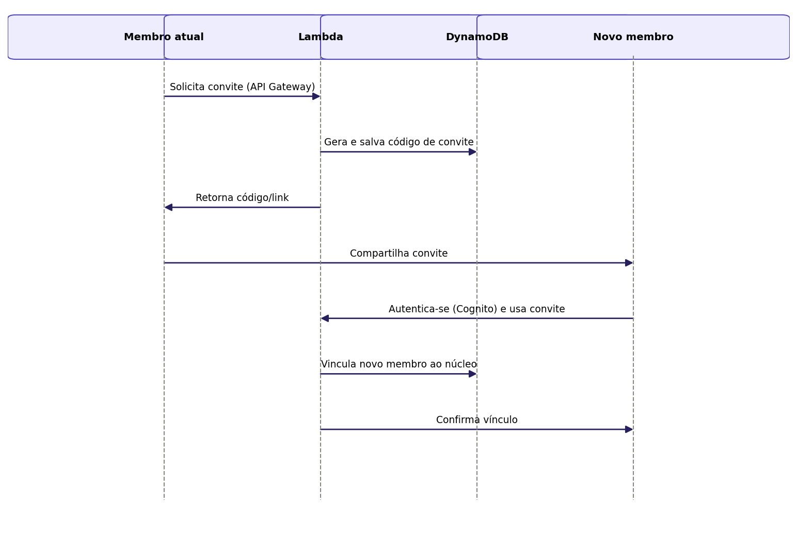

## Caso de Uso 03: Vincular Membro ao Núcleo

**Ator principal/primário:** Membro da família (já vinculado a um núcleo)

**Meta no contexto do projeto:** Permitir que um membro já existente convide e vincule novos membros ao núcleo familiar.

### Pré-condições:

O usuário deve estar autenticado e vinculado a um núcleo familiar.

### Fluxo principal / Cenários:

O usuário seleciona a opção "Convidar membro".

O sistema gera um código ou link de convite.

O usuário compartilha o convite com o novo membro.

O novo usuário se autentica no sistema (Caso de Uso 01).

O novo usuário utiliza o convite recebido.

O sistema vincula o novo usuário ao núcleo familiar.

### Exceções e Fluxos alternativos:

**Exceção 1 (Convite inválido ou expirado):** Se o convite estiver expirado ou inválido, o sistema exibirá uma mensagem de erro e não realizará o vínculo.

**Prioridade:** Alta

**Frequência de uso:** Baixa

**Canal de interação com atores primário e secundários:** Interface Web.

