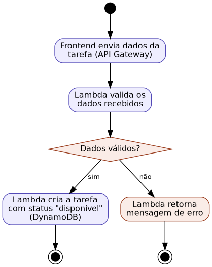

## Caso de Uso 04: Cadastrar Tarefa

**Ator principal/primário:** Membro da família

**Meta no contexto do projeto:** Permitir que um membro cadastre uma nova tarefa doméstica para ser distribuída entre os membros do núcleo.

### Pré-condições:

O usuário deve estar autenticado e vinculado a um núcleo familiar.

### Fluxo principal / Cenários:

O usuário seleciona a opção "Nova tarefa".

O sistema exibe um formulário solicitando nome, pontuação, idade mínima e horário-limite.

O usuário preenche os campos e confirma o cadastro.

O sistema valida os dados informados.

O sistema cria a tarefa com status "disponível" e a torna visível para os membros elegíveis do núcleo.

### Exceções e Fluxos alternativos:

**Exceção 1 (Dados inválidos):** Se o horário-limite informado já tiver passado ou algum campo obrigatório não for preenchido, o sistema exibirá uma mensagem de erro e não criará a tarefa.

**Prioridade:** Alta

**Frequência de uso:** Média

**Canal de interação com atores primário e secundários:** Interface Web.

