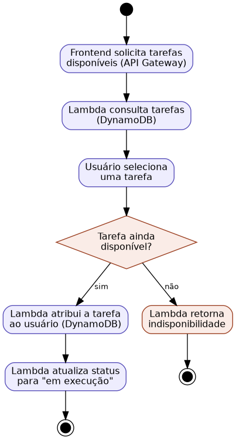

## Caso de Uso 05: Escolher Tarefa

**Ator principal/primário:** Membro da família

**Meta no contexto do projeto:** Permitir que um membro elegível escolha, para si, uma tarefa disponível no núcleo familiar.

### Pré-condições:

Deve existir ao menos uma tarefa com status "disponível".

O membro deve atender à idade mínima exigida pela tarefa.

O horário-limite da tarefa ainda não deve ter sido atingido.

### Fluxo principal / Cenários:

O usuário visualiza a lista de tarefas disponíveis.

O usuário seleciona uma tarefa.

O sistema atribui a tarefa ao usuário.

O sistema altera o status da tarefa para "em execução".

### Exceções e Fluxos alternativos:

**Exceção 1 (Tarefa já escolhida):** Se a tarefa já tiver sido escolhida por outro membro no momento da confirmação, o sistema exibirá uma mensagem informando a indisponibilidade e atualizará a lista.

**Prioridade:** Alta

**Frequência de uso:** Alta

**Canal de interação com atores primário e secundários:** Interface Web.

