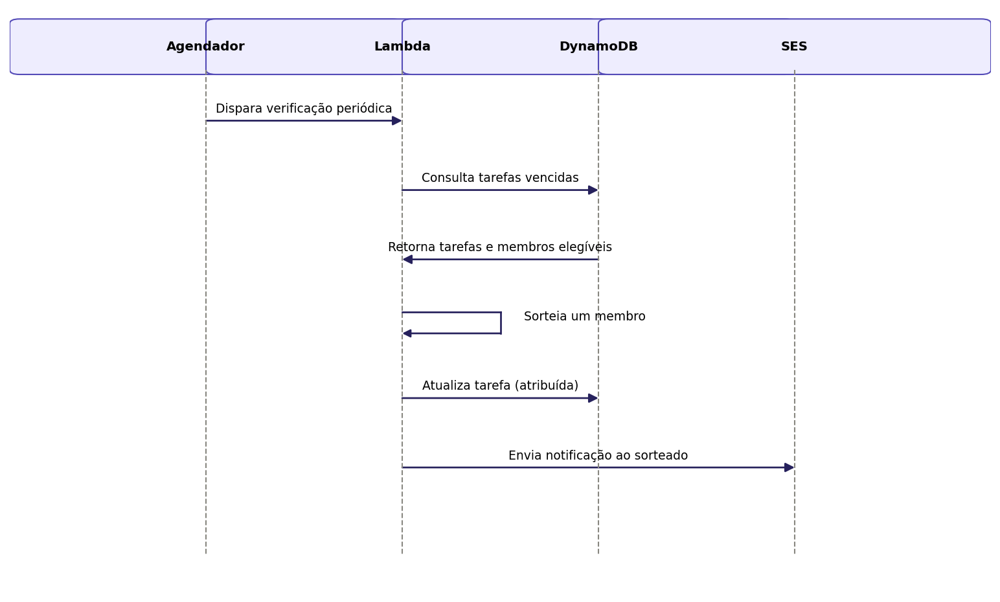

## Caso de Uso 06: Sortear Tarefa Automaticamente

**Ator principal/primário:** Sistema

**Meta no contexto do projeto:** Garantir que nenhuma tarefa fique sem responsável, atribuindo-a automaticamente quando o horário-limite é atingido sem escolha manual.

### Pré-condições:

Deve existir uma tarefa com status "disponível" cujo horário-limite tenha sido atingido.

### Fluxo principal / Cenários:

O sistema identifica a tarefa vencida.

O sistema filtra os membros do núcleo que atendem à idade mínima exigida pela tarefa.

O sistema sorteia um membro entre os elegíveis.

O sistema atribui a tarefa ao membro sorteado e altera o status para "em execução".

O sistema notifica o membro sorteado.

### Exceções e Fluxos alternativos:

**Fluxo alternativo 1 (Nenhum membro elegível):** Se não houver nenhum membro elegível no momento do sorteio, a tarefa permanece com status "disponível".

**Prioridade:** Alta

**Frequência de uso:** Média

**Canal de interação com atores primário e secundários:** Rotina automática (backend).

