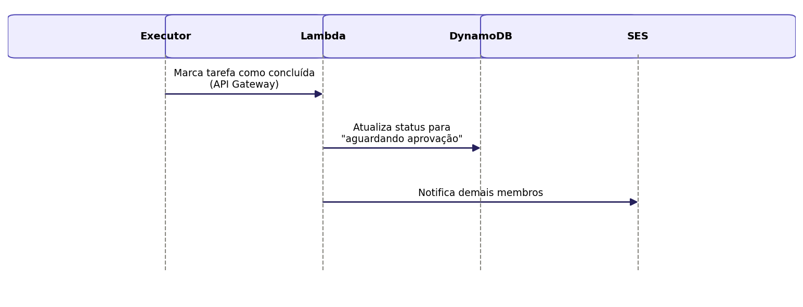

## Caso de Uso 07: Marcar Tarefa como Concluída

**Ator principal/primário:** Membro da família (executor)

**Meta no contexto do projeto:** Permitir que o membro responsável sinalize que a tarefa atribuída a ele foi realizada.

### Pré-condições:

A tarefa deve estar com status "em execução" e atribuída ao usuário.

### Fluxo principal / Cenários:

O usuário acessa a tarefa atribuída a ele.

O usuário seleciona a opção "Marcar como concluída".

O sistema altera o status da tarefa para "aguardando aprovação".

O sistema notifica os demais membros do núcleo familiar.

### Exceções e Fluxos alternativos:

Não se aplica.

**Prioridade:** Alta

**Frequência de uso:** Alta

**Canal de interação com atores primário e secundários:** Interface Web.

