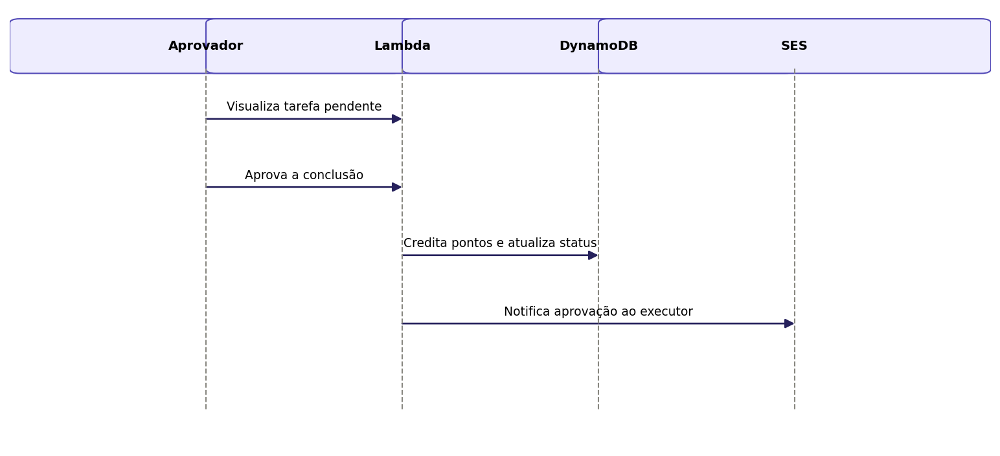

## Caso de Uso 08: Aprovar ou Rejeitar Conclusão

**Ator principal/primário:** Membro da família (diferente do executor)

**Meta no contexto do projeto:** Garantir que a conclusão de uma tarefa seja validada por outro membro antes de creditar os pontos, evitando fraude no sistema de pontuação.

### Pré-condições:

A tarefa deve estar com status "aguardando aprovação".

O usuário que aprova deve ser diferente do usuário que executou a tarefa.

### Fluxo principal / Cenários:

O usuário visualiza a tarefa pendente de aprovação.

O usuário aprova a conclusão da tarefa.

O sistema credita os pontos ao membro executor.

O sistema altera o status da tarefa para "concluída".

### Exceções e Fluxos alternativos:

**Fluxo alternativo 1 (Rejeição):** Se o usuário rejeitar a conclusão, o sistema retorna o status da tarefa para "disponível" e não credita pontos.

**Prioridade:** Alta

**Frequência de uso:** Alta

**Canal de interação com atores primário e secundários:** Interface Web.

