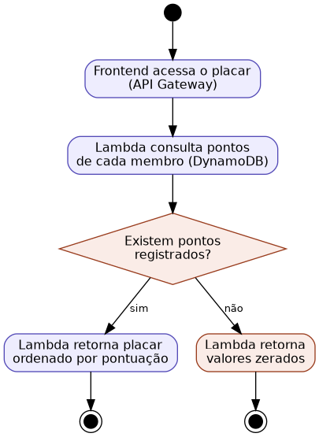

## Caso de Uso 09: Visualizar Placar

**Ator principal/primário:** Membro da família

**Meta no contexto do projeto:** Fornecer ao usuário uma visão da pontuação acumulada por cada membro do núcleo familiar.

### Pré-condições:

O usuário deve estar autenticado e vinculado a um núcleo familiar.

### Fluxo principal / Cenários:

O usuário acessa a tela de placar.

O sistema busca a pontuação acumulada de cada membro do núcleo.

O sistema exibe o placar ordenado por pontuação.

### Exceções e Fluxos alternativos:

**Fluxo alternativo 1 (Nenhum ponto registrado):** Se nenhum membro tiver pontos registrados, o sistema exibirá os valores como zero.

**Prioridade:** Média

**Frequência de uso:** Alta

**Canal de interação com atores primário e secundários:** Interface Web.

